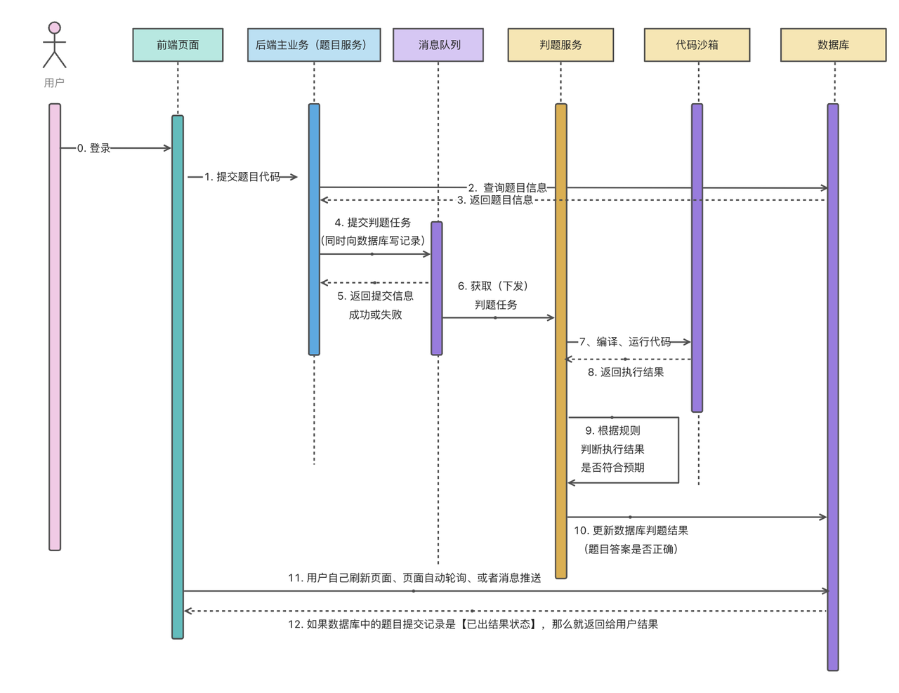

# 智能在线判题平台-前端

> **GitHub 项目地址**
>
> [前端](https://github.com/codehev/oj-frontend) | [后端](https://github.com/codehev/oj-backend) | [后端（微服务版）](https://github.com/codehev/oj-backend-microservice) | [代码沙箱](https://github.com/codehev/oj-code-sandbox)

## 项目介绍

NexGenOJ是一个基于 Vue 3 + Spring Boot + Spring Cloud 微服务 + Docker 的**编程题目在线评测系统**（简称 OJ）的前端部分。该系统允许用户在线编写、提交代码，并获得实时的评测结果。

本前端项目使用Vue 3框架开发，采用TypeScript进行类型检查，集成了Arco Design组件库，提供美观、现代的用户界面。

## 前端架构

本项目采用清晰的分层架构：

- **视图层(Views)**: 用户可见的页面组件
- **组件层(Components)**: 可复用的UI组件
- **路由层(Router)**: 页面导航
- **状态管理(Store)**: 全局状态
- **网络请求(API)**: 与后端交互
- **工具类(Utils)**: 通用功能
- **类型定义(Types)**: TypeScript类型
- **常量定义(Constants)**: 系统常量
- **资源文件(Assets)**: 静态资源

## 核心功能

### 用户功能

1. **用户认证**
   - 用户注册
   - 用户登录
   - 第三方登录集成

2. **个人中心**
   - 个人资料管理
   - 做题记录与统计
   - 收藏的题目

### 题目相关

1. **题目列表**
   - 题目浏览
   - 按难度、标签、状态筛选
   - 题目搜索

2. **题目详情**
   - Markdown题目描述
   - 示例输入/输出
   - 题目提示
   - 相关标签

3. **代码编辑**
   - 集成Monaco Editor
   - 支持多种编程语言
   - 代码高亮
   - 语法检查

4. **代码提交**
   - 提交评测
   - 实时状态更新
   - 结果分析

### 管理功能

1. **题目管理**
   - 创建题目
   - 编辑题目
   - 设置测试用例
   - 管理题目标签

2. **系统管理**
   - 用户管理
   - 权限配置
   - 系统设置

## 技术栈

- **核心框架**: Vue 3
- **开发语言**: TypeScript
- **构建工具**: Vue CLI
- **状态管理**: Vuex
- **UI组件库**: Arco Design
- **HTTP客户端**: Axios
- **代码编辑器**: Monaco Editor
- **Markdown渲染**: Markdown-it
- **CSS预处理器**: SCSS
- **代码规范**: ESLint + Prettier
- **API生成**: OpenAPI
- **路由管理**: Vue Router

## 项目结构

```
src/
├── access/         # 权限控制
├── assets/         # 静态资源
├── components/     # 公共组件
│   ├── CodeEditor/ # 代码编辑器组件
│   ├── MarkdownViewer/ # Markdown查看器
│   └── ...
├── constant/       # 常量定义
├── enum/           # 枚举定义
├── layouts/        # 布局组件
├── router/         # 路由配置
├── store/          # Vuex状态管理
├── utils/          # 工具函数
└── views/          # 页面视图
    ├── admin/      # 管理界面
    ├── question/   # 题目相关页面
    ├── user/       # 用户相关页面
    └── ...
```

## 特色亮点

1. **灵活的代码编辑器**
   - 支持多种编程语言
   - 自定义主题
   - 代码补全
   - 快捷键支持

2. **实时状态反馈**
   - 提交状态实时更新
   - 详细的执行结果
   - 性能指标可视化

3. **响应式设计**
   - 适配桌面和移动设备
   - 深色/浅色主题切换
   - 个性化界面配置

4. **Markdown增强**
   - 数学公式支持
   - 代码高亮
   - 自定义样式

## 快速开始

### 环境要求

- Node.js 14+
- npm 6+ 或 yarn 1.22+

### 开发环境搭建

1. 克隆项目
   ```bash
   git clone https://github.com/codehev/oj-frontend.git
   cd oj-frontend
   ```

2. 安装依赖
   ```bash
   npm install
   # 或者
   yarn install
   ```

3. 启动开发服务器
   ```bash
   npm run serve
   # 或者
   yarn serve
   ```

4. 访问开发服务器
   ```
   http://localhost:8080
   ```

### 生产环境构建

```bash
# 构建生产版本
npm run build
# 或者
yarn build
```

### 项目配置

1. 环境变量配置

   在项目根目录创建`.env.development`和`.env.production`文件来配置不同环境的变量。

   ```
   # .env.development
   VUE_APP_API_BASE_URL=http://localhost:8101/api
   ```

2. 代理配置

   在`vue.config.js`中修改代理配置，用于本地开发时请求后端API：

   ```javascript
   module.exports = {
     devServer: {
       proxy: {
         '/api': {
           target: 'http://localhost:8101',
           changeOrigin: true
         }
       }
     }
   }
   ```

## API集成

本项目使用OpenAPI自动生成API调用代码。

1. 通过后端Swagger文档自动生成TypeScript接口定义
2. 类型安全的API调用
3. 减少前后端沟通成本

可以通过以下命令更新API定义：

```bash
npm run generate-api
```

## 项目业务流



## 状态管理

本项目使用Vuex进行状态管理，主要存储：

- 用户信息和登录状态
- 全局UI配置
- 题目列表缓存
- 代码编辑器配置

## 路由与权限

### 基本路由

```
/                  # 首页
/login             # 登录页
/register          # 注册页
/question/list     # 题目列表
/question/view/:id # 题目详情
/coding/:id        # 代码编辑页
/user/profile      # 用户个人中心
/admin/*           # 管理后台相关页面
```

### 权限控制

使用基于角色的访问控制系统：

- 游客：首页、登录、注册、题目列表、题目详情
- 普通用户：游客权限 + 代码编辑提交、个人中心
- 管理员：所有权限

## 贡献指南

1. Fork 项目
2. 创建特性分支 (`git checkout -b feature/AmazingFeature`)
3. 提交更改 (`git commit -m 'Add some AmazingFeature'`)
4. 推送到分支 (`git push origin feature/AmazingFeature`)
5. 开启一个 Pull Request

请确保您的代码通过了所有的lint检查和单元测试。

## 常见问题

**Q: 开发时如何连接后端API？**  
A: 默认连接本地8101端口，可通过修改环境变量或代理配置调整。

**Q: 如何添加新页面？**  
A: 在`views`目录添加页面组件，并在`router`中注册路由。

**Q: 如何修改主题？**  
A: 可以在`src/assets/styles`目录下修改全局样式，或调整Arco Design主题变量。

## 许可证

本项目采用 MIT 许可证，详情见 LICENSE 文件。

## 联系方式

如有问题，请通过以下方式联系：
- Email: [codehev@qq.com](mailto:codehev@qq.com)
- GitHub Issues: [https://github.com/codehev/oj-frontend/issues](https://github.com/codehev/oj-frontend/issues)
